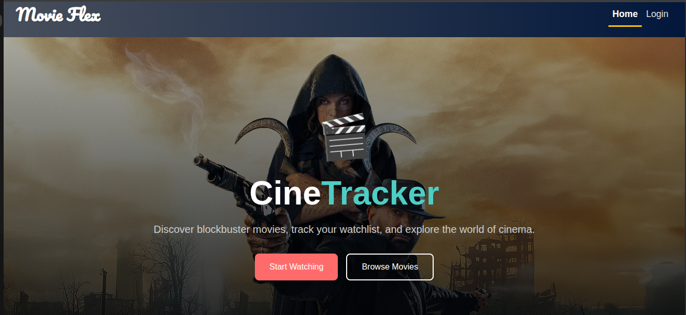
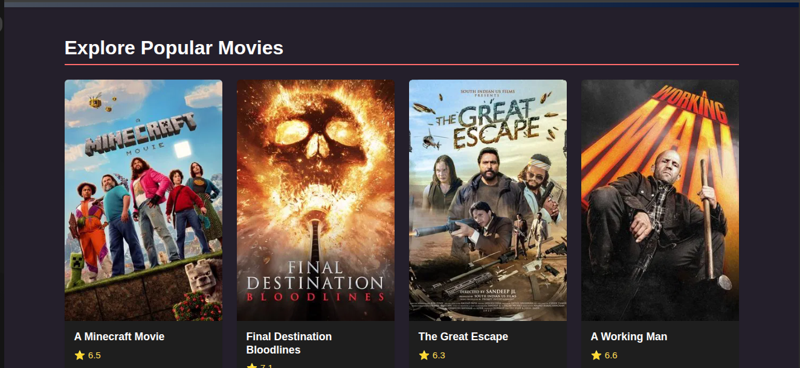
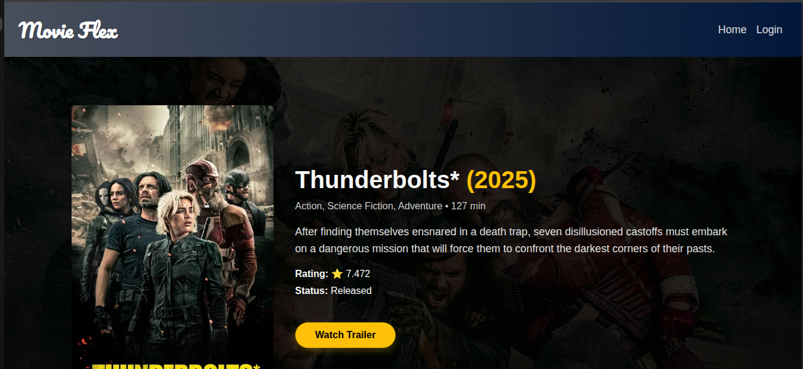
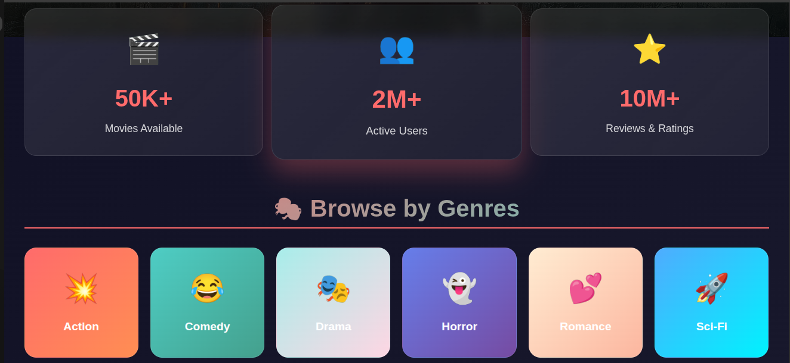
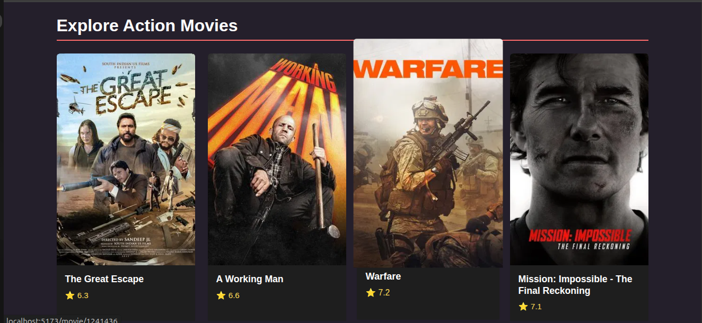
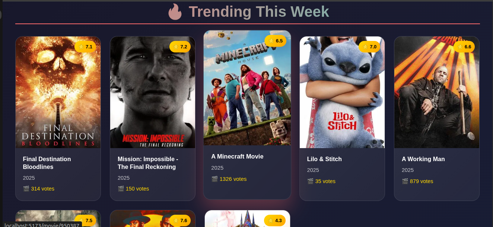
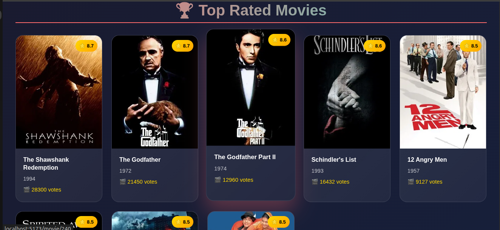

# 🎬 MovieFlex

**MovieFlex** is a beautiful, responsive movie web application that lets users discover popular movies, browse by genre, watch trailers, and manage their watchlist. Built using React, TMDB API, and modern UI practices.

---

## 🚀 Features

- 🔍 **Explore Movies** — Browse popular, trending, and recent movies
- 🎭 **Genre Navigation** — View movies by genres with smooth animations
- 🎞️ **Watch Trailers** — Play trailers for selected movies
- 💬 **Movie Details** — View runtime, rating, description, release year, and more
- 🧠 **Recommendations** — Explore recommended movies based on your interests
- 📚 **Create a Watchlist** — Add and track movies you plan to watch *(requires login)*
- 🔐 **Authentication** — Secure login required to start watching or saving movies
- 🌐 **Responsive UI** — Optimized for mobile, tablet, and desktop

---

## 🖼️ Hero Section Preview

The landing hero features animated icons, floating emojis, and random popular movie backdrops to deliver a vibrant cinema-themed intro — all wrapped in a modern aesthetic **not using Netflix colors**, but with a stylish, original palette.

---

## 🧪 Tech Stack

- ⚛️ **React**
- 🧰 **React Router**
- 🧪 **Axios**
- 💅 **Bootstrap + Custom CSS**
- 🔐 **Context API** for authentication
- 🎥 **TMDB API** for movies & trailers
- 🧠 **React Player** for trailers

---

## 📸 Screenshots
### Here are some key pages

#### Home Page
 

#### Explore Page
 

#### Single Movie Page
 

#### Popular Section
 

#### Genre Search Section
 

#### Action Genre Page
 

#### Trending Section
 

#### Top Rated Page
 

---

## 🔧 Installation

1. **Clone the repository**

```bash
git clone https://github.com/your-username/MovieFlex.git
cd MovieFlex
```
2. **Install dependencies**

```bash
npm install
```
---
Set up environment variables

Create a .env file in the root and add your TMDB API key:

```bash
VITE_API_KEY=your_tmdb_api_key
VITE_BASE_URL = https://api.themoviedb.org/3
```
---
Start the development server

```bash
npm run dev
```
